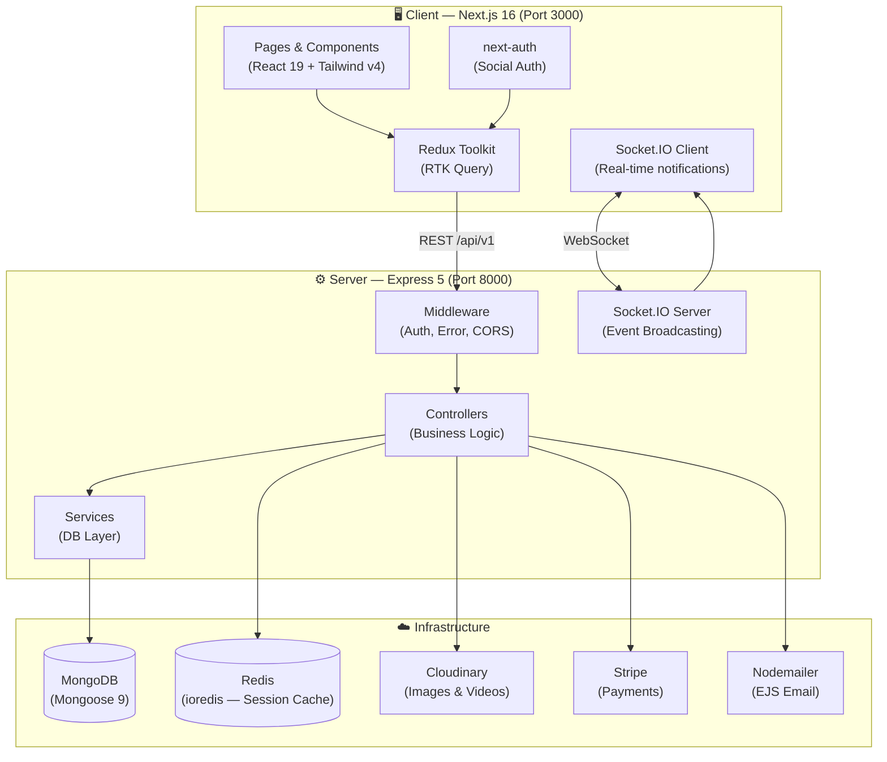
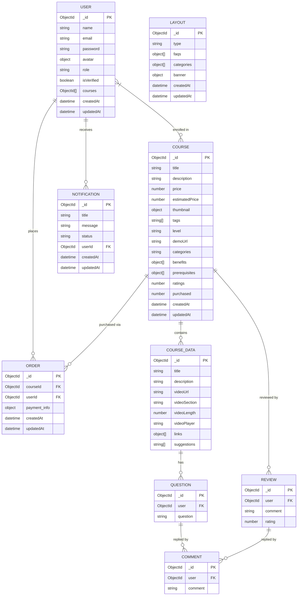
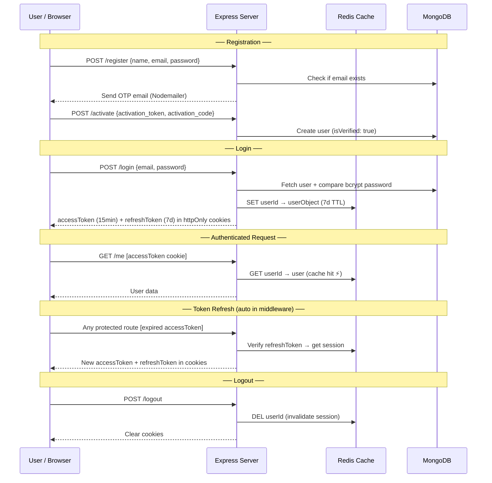
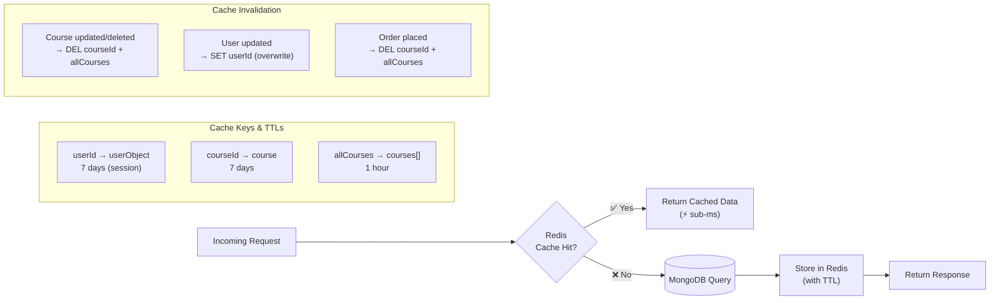

# 🎓 HashField — Where Skills Grow

<div align="center">


> **A production-ready full-stack Learning Management System (LMS)** — browse courses, purchase with Stripe, watch video content, ask Q&A, write reviews, and manage everything from a powerful admin dashboard — all in real-time.

</div>

---

## 📑 Table of Contents

- [✨ Features](#-features)
- [🗂️ Project Structure](#️-project-structure)
- [🏗️ Architecture Overview](#️-architecture-overview)
- [🗃️ Database Schema (ERD)](#️-database-schema-erd)
- [🔐 Authentication Flow](#-authentication-flow)
- [📡 API Reference](#-api-reference)
- [🖥️ Frontend Pages & Routes](#️-frontend-pages--routes)
- [⚡ Caching Strategy](#-caching-strategy)
- [🛠️ Tech Stack](#️-tech-stack)
- [🚀 Getting Started](#-getting-started)
- [🔑 Environment Variables](#-environment-variables)
- [📧 Email Templates](#-email-templates)

---

## ✨ Features

### 👨‍🎓 Students
- 🔐 Register with **email OTP verification** or **Social Auth** (Google / GitHub)
- 🛒 Purchase courses via **Stripe** (Payment Intent flow)
- 🎬 Watch gated **video content** (enrolled-only access)
- ❓ Ask & answer **Q&A** per video section
- ⭐ Write **reviews & ratings** for enrolled courses
- 🖼️ Update **profile avatar** (Cloudinary upload)
- 🔑 Secure **password management**

### 🛡️ Admins
- 📊 **Analytics dashboard** — user/order/course growth (last 12 months via Recharts)
- 📚 **Full course CRUD** — create, edit, delete with thumbnail upload (Cloudinary)
- 👥 **User management** — list all users, change roles, delete accounts
- 🧾 **Order management** — view all purchase records
- 🔔 **Real-time notifications** via Socket.IO (new orders, questions, reviews)
- 🎨 **Layout management** — edit Hero banner, FAQs, and course Categories
- 🔁 Auto-delete read notifications older than **30 days** (node-cron)

---

## 🗂️ Project Structure

```
LMS_DEVWEEKENDS/
├── client/                    # Next.js 16 Frontend
│   └── app/
│       ├── (routes)/          # App Router pages
│       │   ├── about/
│       │   ├── admin/         # Admin dashboard pages
│       │   │   ├── categories/
│       │   │   ├── courses/
│       │   │   ├── courses-analytics/
│       │   │   ├── create-course/
│       │   │   ├── edit-course/
│       │   │   ├── faq/
│       │   │   ├── hero/
│       │   │   ├── invoices/
│       │   │   ├── orders-analytics/
│       │   │   ├── team/
│       │   │   ├── users/
│       │   │   └── users-analytics/
│       │   ├── course-access/
│       │   ├── courses/
│       │   ├── faq/
│       │   ├── policy/
│       │   └── profile/
│       ├── components/        # Shared UI components
│       │   ├── Auth/          # Login, Register, Verification
│       │   ├── Course/        # Course cards, details, player
│       │   ├── Profile/       # Profile page components
│       │   ├── Route/         # Hero, Stats, Courses, Reviews, FAQs
│       │   ├── admin/         # Admin dashboard components
│       │   └── hooks/         # Custom React hooks
│       ├── redux/
│       │   ├── features/      # Auth slice
│       │   ├── services/      # RTK Query API + Course API
│       │   └── store.ts
│       ├── types/             # TypeScript interfaces
│       └── utils/             # Heading, CustomModel, etc.
│
└── server/                    # Express Backend
    ├── app.ts                 # Express setup, CORS, routes
    ├── server.ts              # Entry point — DB, Cloudinary, Socket.IO
    ├── socketServer.ts        # Socket.IO server
    ├── controllers/           # Business logic
    ├── models/                # Mongoose schemas
    ├── routes/                # Express routers
    ├── middleware/            # Auth, error handling
    ├── services/              # Reusable DB layer
    ├── utils/                 # JWT, Redis, DB, Mail, Analytics
    ├── mails/                 # EJS email templates
    └── @types/                # Express augmentation (req.user)
```

---

## 🏗️ Architecture Overview



---

## 🗃️ Database Schema (ERD)



---

## 🔐 Authentication Flow



---

## 📡 API Reference

All routes are prefixed with `/api/v1`

### 👤 User Routes

| Method | Endpoint | Auth | Role | Description |
|--------|----------|:----:|:----:|-------------|
| `POST` | `/register` | ❌ | — | Register — sends OTP activation email |
| `POST` | `/activate` | ❌ | — | Activate account with JWT + OTP |
| `POST` | `/login` | ❌ | — | Login → sets httpOnly JWT cookies |
| `POST` | `/logout` | ✅ | user | Clears cookies + Redis session |
| `GET` | `/refresh` | ❌ | — | Refresh access token via cookie |
| `GET` | `/me` | ✅ | user | Get current user (Redis cache) |
| `POST` | `/socialAuth` | ❌ | — | Social login (Google / GitHub) |
| `PUT` | `/update-user-info` | ✅ | user | Update name / email |
| `PUT` | `/update-user-avatar` | ✅ | user | Upload profile picture (Cloudinary) |
| `PUT` | `/update-password` | ✅ | user | Change password |
| `GET` | `/get-all-users` | ✅ | admin | List all users |
| `PUT` | `/update-role` | ✅ | admin | Change user role |
| `DELETE` | `/delete-user/:id` | ✅ | admin | Delete user by ID |

---

### 📚 Course Routes

| Method | Endpoint | Auth | Role | Description |
|--------|----------|:----:|:----:|-------------|
| `POST` | `/create-course` | ✅ | admin | Create course (Cloudinary thumbnail) |
| `PUT` | `/edit-course/:id` | ✅ | admin | Edit course — smart thumbnail diff |
| `GET` | `/get-all-courses` | ❌ | — | Public course list (Redis cached, no content) |
| `GET` | `/get-course/:id` | ❌ | — | Single course details (Redis cached, no content) |
| `GET` | `/get-course-content/:id` | ✅ | user | Full course content (enrollment gated) |
| `POST` | `/add-question` | ✅ | user | Add question to a video section |
| `POST` | `/add-question-answer` | ✅ | user | Reply to a question (sends email) |
| `POST` | `/add-review/:courseId` | ✅ | user | Submit review & rating (1–5) |
| `POST` | `/add-reply-to-review` | ✅ | admin | Admin reply to a review |
| `GET` | `/:id/get-all-reviews` | ✅ | user | Get all reviews for a course |
| `GET` | `/get-all-courses-for-admin` | ✅ | admin | Full course list with all data |
| `DELETE` | `/delete-course/:id` | ✅ | admin | Delete course + Redis cache |

---

### 🛒 Order Routes

| Method | Endpoint | Auth | Role | Description |
|--------|----------|:----:|:----:|-------------|
| `GET` | `/stripe-publishable-key` | ❌ | — | Get Stripe publishable key |
| `POST` | `/payment` | ✅ | user | Create Stripe PaymentIntent |
| `POST` | `/create-order` | ✅ | user | Confirm order (validates payment, enrolls user, sends email) |
| `GET` | `/get-orders` | ✅ | admin | List all orders |

---

### 🔔 Notification Routes

| Method | Endpoint | Auth | Role | Description |
|--------|----------|:----:|:----:|-------------|
| `GET` | `/get-all-notifications` | ✅ | admin | Get all notifications (latest first) |
| `PUT` | `/update-notification-status/:id` | ✅ | admin | Mark single notification as read |
| `PUT` | `/update-all-notification` | ✅ | admin | Mark all notifications as read |

> 🕛 A `node-cron` job runs **daily at midnight** and auto-deletes all read notifications older than 30 days.

---

### 📊 Analytics Routes

| Method | Endpoint | Auth | Role | Description |
|--------|----------|:----:|:----:|-------------|
| `GET` | `/get-users-analytics` | ✅ | admin | User signups (last 12 × 28-day periods) |
| `GET` | `/get-orders-analytics` | ✅ | admin | Orders (last 12 × 28-day periods) |
| `GET` | `/get-courses-analytics` | ✅ | admin | Course creation (last 12 × 28-day periods) |

---

### 🎨 Layout Routes

| Method | Endpoint | Auth | Role | Description |
|--------|----------|:----:|:----:|-------------|
| `POST` | `/create-layout` | ✅ | admin | Create layout (Banner / FAQ / Categories) |
| `PUT` | `/edit-layout` | ✅ | admin | Edit existing layout |
| `GET` | `/get-layout/:type` | ❌ | — | Get layout by type string |

---

## 🖥️ Frontend Pages & Routes

### Public Pages
| Route | Description |
|-------|-------------|
| `/` | Home — Hero, Stats, Featured Courses, Reviews, FAQs |
| `/courses` | Browse all courses |
| `/courses/:id` | Single course detail |
| `/about` | About page |
| `/faq` | FAQ page |
| `/policy` | Privacy policy |

### Protected (User)
| Route | Description |
|-------|-------------|
| `/profile` | User profile — avatar, info, password, enrolled courses |
| `/course-access/:id` | Gated course player — video, Q&A, sections |

### Admin Dashboard
| Route | Description |
|-------|-------------|
| `/admin` | Dashboard overview |
| `/admin/create-course` | Create new course (multi-step form) |
| `/admin/courses` | Manage all courses |
| `/admin/edit-course/:id` | Edit course |
| `/admin/users` | Manage users |
| `/admin/team` | Manage admin team |
| `/admin/invoices` | View all orders |
| `/admin/users-analytics` | Users growth chart (Recharts) |
| `/admin/orders-analytics` | Orders growth chart (Recharts) |
| `/admin/courses-analytics` | Courses growth chart (Recharts) |
| `/admin/hero` | Edit homepage hero banner |
| `/admin/faq` | Edit FAQ items |
| `/admin/categories` | Manage course categories |

---

## ⚡ Caching Strategy



---

## 🛠️ Tech Stack

### Backend
| Layer | Technology |
|-------|-----------|
| Runtime | Node.js + TypeScript 7 |
| Framework | Express 5 |
| Database | MongoDB (Mongoose 9) |
| Cache / Session | Redis (ioredis 6) |
| Auth | JWT — access (15m) + refresh (7d) tokens in httpOnly cookies |
| File Storage | Cloudinary v2 (avatars + course thumbnails) |
| Payments | Stripe (PaymentIntents API) |
| Email | Nodemailer + EJS templates |
| Real-time | Socket.IO v4 |
| Scheduler | node-cron |
| Dev Server | `tsx watch` |

### Frontend
| Layer | Technology |
|-------|-----------|
| Framework | Next.js 16 (App Router) |
| UI Library | React 19 |
| Styling | Tailwind CSS v4 |
| State Management | Redux Toolkit (RTK Query) |
| Social Auth | next-auth v4 |
| Charts | Recharts |
| Payments | @stripe/react-stripe-js |
| Real-time | socket.io-client |
| Notifications | react-hot-toast |
| Theme | next-themes (dark/light) |
| Fonts | Poppins + Josefin Sans (next/font) |
| Icons | lucide-react + react-icons |

---

## 🚀 Getting Started

### Prerequisites
- Node.js 18+
- MongoDB Atlas cluster (or local)
- Redis instance (Upstash recommended for cloud)
- Cloudinary account
- Stripe account
- Gmail with App Password (for Nodemailer)

### 1. Clone the repo

```bash
git clone https://github.com/your-username/LMS_DEVWEEKENDS.git
cd LMS_DEVWEEKENDS
```

### 2. Start the Backend

```bash
cd server
npm install
# Create .env (see section below)
npm run dev
```

Server runs at → `http://localhost:8000`  
Health check: `GET /test` → `{ success: true, message: "Api is working" }`

### 3. Start the Frontend

```bash
cd client
npm install
# Create .env (see section below)
npm run dev
```

App runs at → `http://localhost:3000`

---

## 🔑 Environment Variables

### `/server/.env`

```env
# Server
PORT=8000
NODE_ENV=development
ORIGIN=http://localhost:3000

# MongoDB
DB_URL=mongodb+srv://<user>:<password>@cluster.mongodb.net/lms

# Redis (Upstash or local)
REDIS_URL=rediss://:password@your-upstash-url:6380

# JWT
ACTIVATION_SECRET=your_activation_secret
ACCESS_TOKEN=your_access_token_secret
REFRESH_TOKEN=your_refresh_token_secret
ACCESS_TOKEN_EXPIRE=300        # in hours
REFRESH_TOKEN_EXPIRE=1200      # in days

# Cloudinary
CLOUD_NAME=your_cloud_name
CLOUD_API_KEY=your_api_key
CLOUD_SECRET_KEY=your_secret_key

# Nodemailer (Gmail)
SMTP_HOST=smtp.gmail.com
SMTP_PORT=587
SMTP_USER=your@gmail.com
SMTP_PASS=your_app_password
SMTP_MAIL=your@gmail.com

# Stripe
STRIPE_SECRET_KEY=sk_test_...
STRIPE_PUBLISHABLE_KEY=pk_test_...
```

### `/client/.env`

```env
NEXT_PUBLIC_SERVER_URI=http://localhost:8000/api/v1
NEXTAUTH_SECRET=your_nextauth_secret
NEXTAUTH_URL=http://localhost:3000
NEXT_PUBLIC_STRIPE_PUBLISHABLE_KEY=pk_test_...
```

---

## 📧 Email Templates

Email templates are written in **EJS** and rendered server-side before sending via Nodemailer.

| Template | Trigger |
|----------|---------|
| `activation-mail.ejs` | User registration — sends 4-digit OTP code |
| `order-confirmation.ejs` | Successful course purchase — includes order ID, course name, price, date |
| `question-reply-email.ejs` | Someone replies to your Q&A question in a course section |

---

## ⚠️ Known Issues & Areas for Improvement

| Area | Issue |
|------|-------|
| `course.controller.ts` L203 | `console.log("dataByContent", ...)` — debug log left in production code |
| `course.controller.ts` L536 | `console.log(getAllCourseReviews)` — logs the function reference, not useful |
| `user.route.ts` L21 | Imports `deleteUserById` from services but never uses it directly (already called via controller) — unused import |
| `auth.middleware.ts` | `ACCESS_TOKEN_EXPIRE` env is parsed as hours but used inconsistently — double-check units match `.env` documentation |
| `socketServer.ts` | No CORS config on Socket.IO — in production this may cause connection rejections from the browser client |
| `order.model.ts` | `payment_info: Object` is too loose — consider a typed interface for Stripe payment data |
| `layout.tsx` (client) | Imports `useLoadUserQuery` at the top level of a Server Component — `use client` directive is missing; this may cause a hydration warning |

---

## 🤝 Contributing

1. Fork the repository
2. Create a feature branch: `git checkout -b feature/your-feature`
3. Commit your changes: `git commit -m 'feat: add your feature'`
4. Push to the branch: `git push origin feature/your-feature`
5. Open a Pull Request

---

## 📜 License

MIT © HashField — DevWeekends
